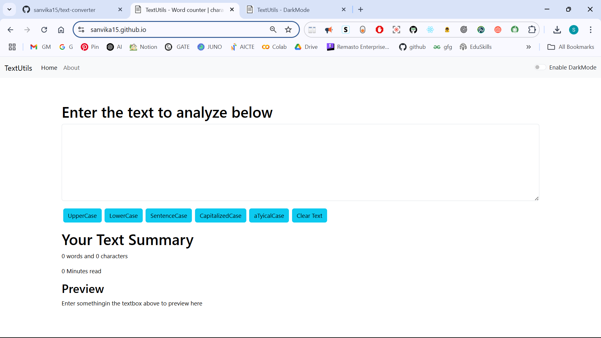

# 📝 Text Converter

A simple and powerful React-based text utility tool that allows users to convert text into various cases like UPPERCASE, lowercase, Sentence case, Capitalized Case, and even aLtErNaTiNg cAsE. It also provides live word and character counts, estimated reading time, and a live preview.

## 🚀 Features

- 🔡 Convert text to:
  - UPPERCASE
  - lowercase
  - Sentence case
  - Capitalized Case
  - aLtErNaTiNg cAsE
- 📊 Live word & character count
- ⏱ Estimated reading time
- 👀 Live preview of the converted text
- 🌙 Light / Dark mode toggle

## 🛠 Tech Stack

- React.js
- HTML5
- CSS3
- JavaScript

## 📸 Screenshots



## 📦 Installation

```bash
git clone https://github.com/sanvika15/text-converter.git
cd text-converter
npm install
npm start
